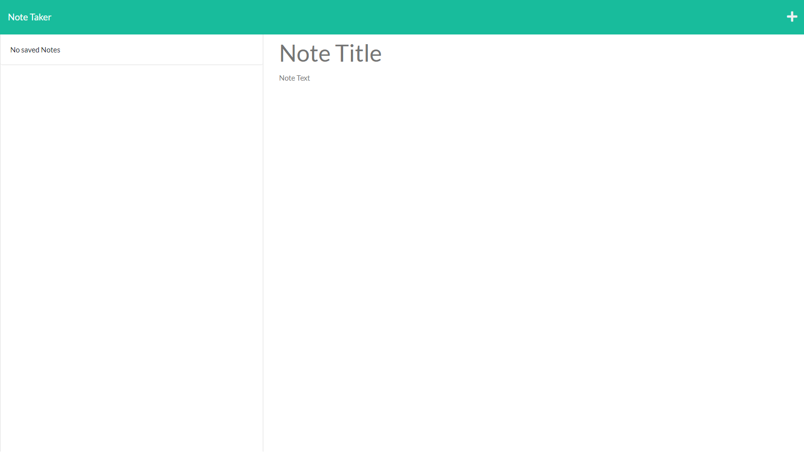
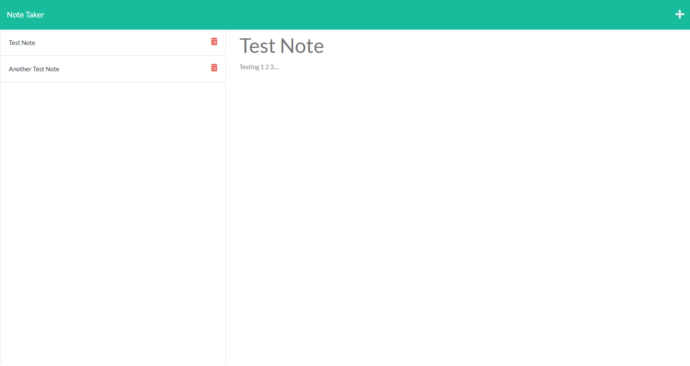

# Pocket Note

# MIT 

## MIT License 
 

# User Story 
AS A small business owner 
 
I WANT to be able to write and save notes
 
SO THAT I can organize my thoughts and keep track of tasks I need to complete

# Table of Contents 
- [Pocket Note](#pocket-note)
- [MIT](#mit)
  - [MIT License](#mit-license)
- [User Story](#user-story)
- [Table of Contents](#table-of-contents)
- [Description](#description)
- [Technologies Used](#technologies-used)
- [Screenshots](#screenshots)
- [Application](#application)

# Description 
Note taking application where users can store their thoughts in a quick and organized fashion. 

# Technologies Used
- HTML
- CSS
-  JavaScript
-  Express
-  UUID v4
  
# Screenshots

# Application 

Click the [📝](https://pacific-oasis-81006.herokuapp.com/) to open the application! 
